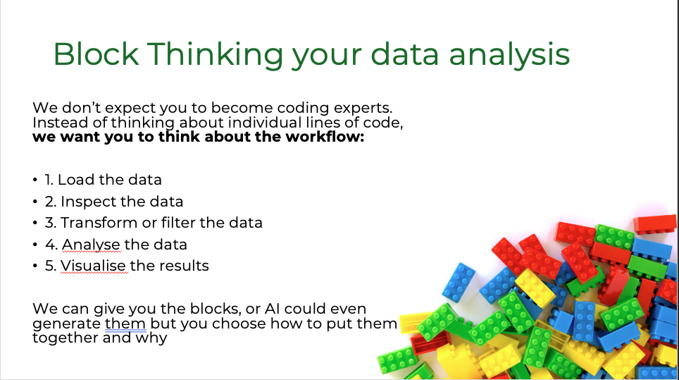
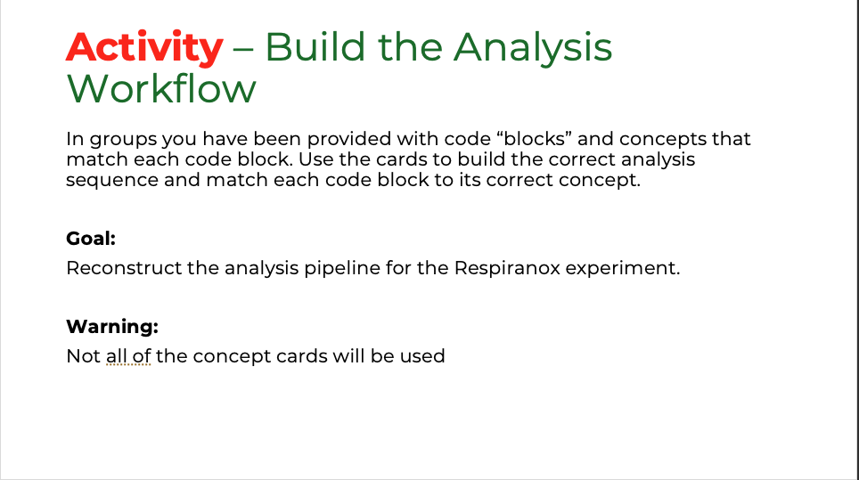
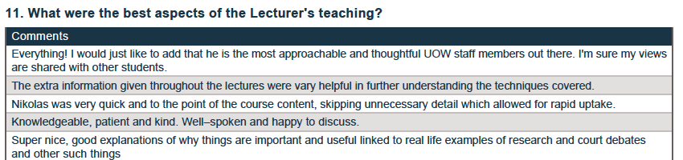
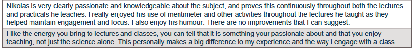

::: {.qualifier-badge}
Qualifier 2 · Inclusive Learning
:::

My approach to teaching and supporting student learning is centred on clarity, accessibility, and active engagement — particularly in areas that students often perceive as difficult or unfamiliar, such as bioinformatics and computational data analysis. I recognise that many biology students experience anxiety when encountering quantitative or coding-based content, and I deliberately structure my teaching to reduce these barriers while maintaining academic rigour.

---

## Clear, Structured Explanations Linked to Biological Meaning

A key feature of my teaching is the use of **clear, structured explanations supported by real-world examples**. I aim to break down complex concepts into manageable components, while consistently linking each step back to the underlying biological question. This approach is particularly important in BIOL340, where students transition from experimental data generation to computational analysis.

During teaching sessions, I explicitly walk through analytical workflows, explaining not only what to do, but *why* each step is necessary and how it contributes to scientific interpretation. This reflects the principles of **constructive alignment** [@biggs2011], where teaching activities are explicitly designed to support students in achieving intended learning outcomes.

Student evaluation data consistently reflects the effectiveness of this approach. Across multiple subjects, I receive high scores for clarity of explanation, organisation, and subject knowledge (typically above **5.5/6.0**), with particularly strong performance in bioinformatics teaching contexts. Students frequently comment that concepts are easy to understand and that the structured delivery helps them engage with complex material.

*[Figure 3: Student evaluation scores demonstrating high ratings for clarity, organisation, and explanation — see evaluation reports in the evidence folder.]*

---

## Active Support and Interactive Engagement

Beyond clarity, I prioritise **active support and engagement during learning**. I adopt a highly interactive teaching style, regularly circulating during sessions, prompting discussion, and encouraging students to ask questions. I also integrate interactive tools such as **Slido** and **Mentimeter** into lectures, using live polls and questions to encourage participation, check understanding in real time, and engage students who may be less likely to contribute verbally. This approach supports a range of learning preferences and aligns with **Universal Design for Learning (UDL)** principles by providing multiple means of engagement and participation.

---

## Separating Experimental and Analytical Components: Dedicated Dry Labs

A major development in my teaching practice has been the **intentional separation of experimental and analytical components of learning**. In BIOL340, I redesigned the practical sequence to introduce dedicated "dry labs" focused exclusively on data analysis and interpretation. This allows students to engage with experimental work and computational analysis as distinct cognitive tasks, reducing overload and improving conceptual understanding.

This approach is informed by **cognitive load theory** [@sweller1988]: separating these components minimises extraneous cognitive load and allows students to focus on the underlying concepts and skills. It also creates space to explicitly teach data analysis as a core scientific capability, rather than treating it as an implicit component of laboratory work.

---

## Block-Based Learning Activities

In response to student feedback that aspects of coding were difficult to understand, I introduced a series of **block-based learning activities** designed to shift the focus from syntax to conceptual understanding. In these activities, code is transformed into a set of physical "puzzle pieces" that students must organise into the correct analytical workflow. This enables students to engage with the logical structure of code without the additional cognitive demand of generating it independently.

This approach aligns with both **cognitive load theory** (reducing unnecessary complexity) and **UDL principles** (incorporating visual and tactile modes of learning alongside traditional instruction).

::: {layout-ncol=3}
{fig-alt="Physical block coding activity" width="100%"}

{fig-alt="Online block-based interface" width="100%"}

{fig-alt="Students engaged in block-based coding activity" width="100%"}
:::

*Figure 4: Block-based coding activity and corresponding online modular code interface.*

This approach is reinforced through a custom-built teaching website, where code is presented in modular "blocks" that students can copy and use directly in their analyses. Together, these strategies emphasise that the key learning outcome is understanding the purpose and function of each step, rather than memorising or reproducing code — supporting a diverse student cohort by accommodating different levels of prior experience and preferred learning styles.

---

## Inclusive and Psychologically Safe Learning Environments

I intentionally design and facilitate learning environments that promote **inclusivity, psychological safety, and active student participation**. I explicitly normalise uncertainty and difficulty as part of the learning process, framing challenges as expected and manageable. This is reflected in student feedback indicating increased confidence in engaging with computational and data-driven content.

Student evaluation scores for respect, approachability, and encouragement of participation are consistently high (up to **6.0/6.0** in some cohorts).

**CHEM325 (2024)**

{fig-alt="CHEM325 2024 evaluation scores" width="100%"}

**BIOL215 (2025)**

{fig-alt="BIOL215 2025 evaluation scores" width="100%"}

*Figure 5: Student evaluation scores and qualitative feedback highlighting supportive and engaging teaching environment.*

Selected student comments:

> *"Nick was always very friendly, nice, and approachable. He answered our questions with a great sense of humour, which made the classroom environment much more engaging."*
>
> — BIOL215 student, 2025

> *"I really liked how down-to-earth Nik was; during practicals he would frequently walk around and ask everyone how we were going and if we had any questions, which was really good when we were stuck."*
>
> — BIOL215 student, 2025

---

## Collaborative and Structured Learning Formats

I also employ a range of **structured and collaborative learning activities**, including think–pair–share discussions and guided problem-solving tasks within practical sessions. These ensure that students can engage with content in multiple ways, supporting diverse learning preferences and prior knowledge levels.

The introduction of block-based thinking activities further supports inclusivity by translating abstract computational concepts into tangible, manipulable forms, allowing students to build understanding without being constrained by coding syntax — developed in direct response to student feedback indicating that traditional coding instruction was a barrier to engagement.

::: {.callout-note appearance="simple"}
**Evidence:** Pre- and post-dry-practical surveys and teaching evaluation reports are available in the evidence folder.
:::

---

**Previous:** [Qualifier 1 — Curriculum Design](cpd1.qmd) · **Next:** [Qualifier 3 — Learning Pathways](cpd3.qmd)
