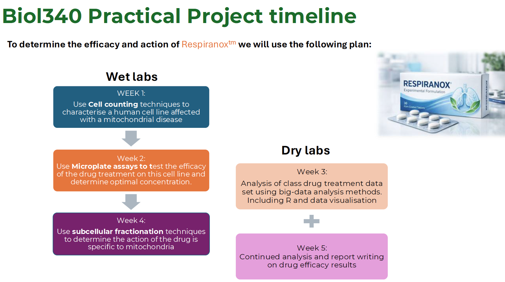
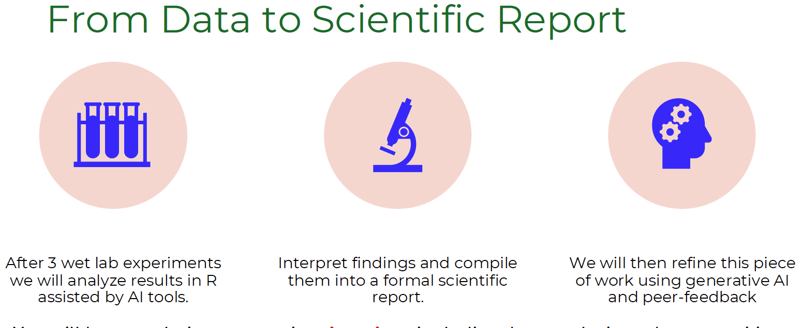
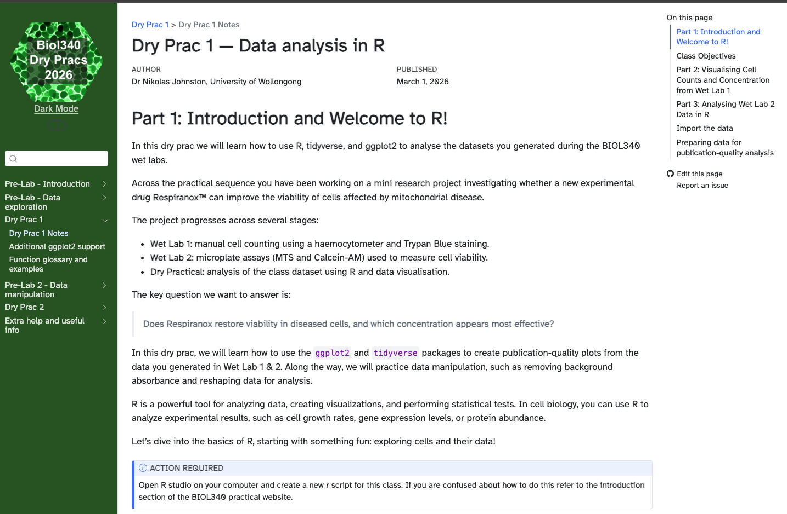

::: qualifier-badge
Qualifier 1 · Curriculum Design
:::

My approach to the design and planning of learning activities is grounded in the principle that modern biology education must develop not only conceptual understanding, but also the ability to work with data, interpret results, and communicate findings effectively. As Subject Coordinator for **BIOL340** (Cell and Molecular Biology), I have led a substantial redesign of the subject to align learning activities with authentic scientific practice, ensuring that students engage with the kinds of workflows they will encounter beyond university.

------------------------------------------------------------------------

## Integration Across the Degree: A Scaffolded Skills Progression

My curriculum design decisions span three interconnected subjects that students typically encounter in sequence across their degree.

-   In **BIOL215**, students are introduced to foundational skills in genetics, genomics, and the analysis of sequence data. This provides the disciplinary and conceptual grounding for more advanced computational work.
-   In **BIOL340** (Cell and Molecular Biology, Autumn), students build on this foundation through data analysis, visualisation, and interpretation using R, with computational skills now embedded within an experimental biology context.
-   In **CHEM325/BIOL984** (Bioinformatics, Spring), the majority of the subject is dedicated to applying and extending these skills across a range of bioinformatics workflows — the most advanced treatment of computational biology in the undergraduate and postgraduate sequence.

This progression represents an intentional, degree-level design decision: rather than treating computational skills as isolated, subject-specific content, I have worked to ensure that each subject builds on and reinforces the skills developed in the previous one. Students arrive in BIOL340 with sequence analysis experience from BIOL215; they arrive in CHEM325/BIOL984 with data analysis experience from BIOL340. The result is a curriculum in which computational literacy develops progressively across the degree, culminating in advanced bioinformatics practice.

This alignment is consistent with the UOW Standards and Quality Framework for Learning, Teaching and Research Training, which emphasises that courses should be structured to provide coherence and progressive development of student capabilities.

------------------------------------------------------------------------

## Subject-Level Design: BIOL340

Central to this redesign is the concept of **constructive alignment** [@biggs2011], where learning outcomes, teaching activities, and assessment are intentionally integrated. In BIOL340, this is achieved through a scaffolded sequence of wet and dry practicals that mirror a complete research pipeline. Students begin with experimental data generation (e.g., cell viability assays), and then transition into data analysis, visualisation, and interpretation using R. This structure ensures that computational skills are not taught in isolation, but are embedded within meaningful biological contexts.

{fig-alt="Diagram showing the scaffolded BIOL340 practical sequence" width="80%"}

{fig-alt="Assessment alignment overview" width="75%"}

*Figure 1: Overview of BIOL340 practical sequence showing alignment between wet lab, dry lab, and assessment tasks.*

### Scaffolding for Diverse Student Backgrounds

A key design consideration has been **scaffolding for diverse student backgrounds**, particularly in computational skills. Recognising that many students enter with limited experience in coding or quantitative analysis, I have structured learning activities to progressively build competence. Early tasks provide highly guided, step-by-step instruction, while later activities require increasing independence in data interpretation and problem-solving. This approach is informed by **cognitive load theory** [@sweller1988], reducing extraneous load while maintaining appropriate academic challenge.

To support this, I have developed a suite of **custom teaching materials**, including a beginner-friendly website, practicals, annotated datasets, and structured workflows that explicitly guide students through the process of importing, cleaning, analysing, and visualising data. These materials are designed to be both instructional and reusable, allowing students to revisit concepts as needed.

{fig-alt="Screenshot of Quarto-based dry practical website" width="85%"}

*Figure 2: Example of Quarto practical showing scaffolded data analysis workflow. [View dry practical 1 website](https://nikolasjohnston.github.io/BIOL340_DP/pages/DP1/DP1_Final.html)*

------------------------------------------------------------------------

## Integration into CHEM325/BIOL984

This design philosophy extends beyond BIOL340 into my teaching in bioinformatics (CHEM325/BIOL984), where I similarly emphasise the integration of theory with applied, real-world datasets. I have redesigned assessments in CHEM325 to equip students with the skills to analyse large-scale real-world datasets, including a formal report that explores the evolution and epidemiology of Zika virus. I similarly apply principles of constructive alignment where computer practicals allow students to obtain and analyse their data, which then directly translates into the results section of their formal report.

Student feedback consistently highlights the value of this approach, with mean scores of approximately **5.8/6.0** for connecting theory with practical applications — indicating that students recognise the relevance and coherence of the learning activities.

------------------------------------------------------------------------

## Iterative Improvement

Importantly, the design of learning activities is informed by ongoing reflection and evaluation. Feedback from BIOL340 identified that while students valued the authenticity of computational tasks, some experienced difficulty when transitioning to independent analysis. In response, I have refined activity design to include clearer transitions between guided and independent work, additional explanatory material, and more explicit links between each analytical step and its biological meaning. This iterative approach reflects a commitment to continuous improvement aligned with the UOW Standards and Quality Framework for Learning, Teaching and Research Training.

::: {.callout-note appearance="simple"}
**Evidence:** Pre- and post-dry-practical survey data are available in the evidence folder. See also the [BIOL340 dry practical website](https://nikolasjohnston.github.io/BIOL340_DP/pages/DP1).
:::

------------------------------------------------------------------------

**Next:** [Qualifier 2 — Inclusive Learning Experiences](cpd2.html)
