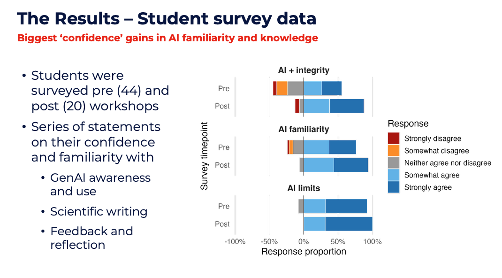
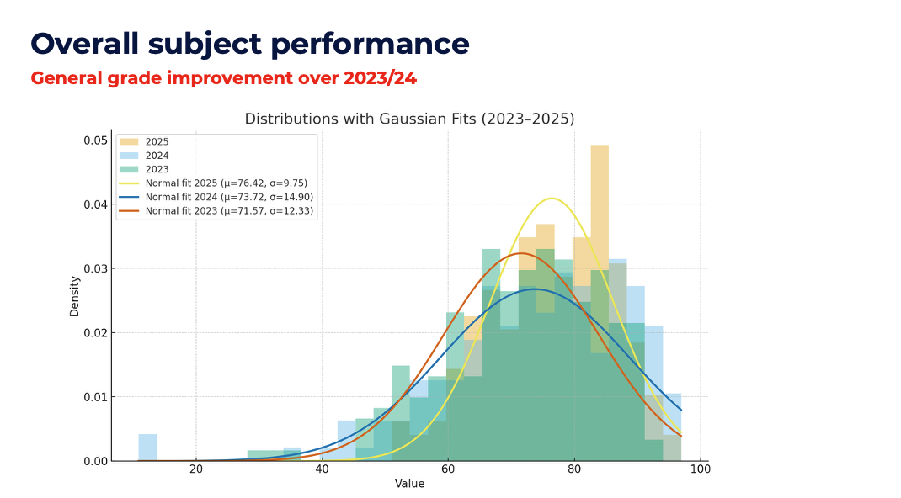

::: qualifier-badge
Qualifier 4 · Scaffolded Assessment
:::

My approach to assessment is grounded in the principle that assessment should both *evaluate* learning and actively *support* it. I design assessment tasks that reflect authentic scientific practice, requiring students to analyse data, interpret results, and communicate findings clearly. In subjects such as BIOL340 and CHEM325/BIOL984, this involves moving beyond recall-based tasks toward assessments that mirror real-world biological workflows — including data analysis, visualisation, and scientific writing.

------------------------------------------------------------------------

## Constructive Alignment

Assessment design is guided by **constructive alignment** [@biggs2011], ensuring that tasks are directly linked to intended learning outcomes and supported by teaching activities. In BIOL340, this is exemplified through a staged assessment structure that aligns with the progression from experimental work to computational analysis and interpretation. Students are required to engage with authentic datasets and produce outputs that reflect real scientific practice, ensuring coherence between what is taught, what is practised, and what is assessed.

------------------------------------------------------------------------

## The Multi-Stage Assessment Model

A key innovation in my assessment practice has been the development of a **multi-stage assessment model**, informed by my Learning and Teaching grant project and aligned with institutional priorities around authentic assessment and academic integrity.

In this model, students first complete a **peer-reviewed scientific report**, requiring them to analyse data and communicate findings in a formal scientific format. This is followed by a **generative AI reflection task**, where students critically evaluate their use of AI tools in the writing and analysis process.

This staged design serves several pedagogical purposes:

1.  **Separation of skill domains** — Separating the development of scientific communication skills from reflective and evaluative thinking reduces cognitive overload and allows students to focus on distinct learning objectives at each stage.

2.  **AI literacy and ethical awareness** — Explicitly embedding AI literacy and ethical awareness into the curriculum ensures that students are not only using emerging tools, but critically engaging with their limitations and implications.

3.  **Iterative feedback** — Creating opportunities for iterative feedback allows students to reflect on and improve their work across stages, rather than receiving feedback only at the end of the process.

------------------------------------------------------------------------

## Alignment with UOW Frameworks

This approach aligns with the **UOW Standards and Quality Framework** (particularly its integration of design, delivery, and performance) and maps directly onto the **UOW Assessment and Feedback Principles**:

| Principle | How It Is Addressed |
|------------------------------------|------------------------------------|
| **Alignment** | Constructive alignment of assessment with learning outcomes and teaching activities |
| **Authenticity** | Real datasets, peer review, and scientific report formats reflecting genuine research practice |
| **Transparency** | Explicit marking criteria, annotated exemplars, and structured task descriptors |
| **Feedback** | Formative checkpoints, in-class verbal feedback, and staged structure enabling action on feedback |
| **Diversity & Inclusion** | UDL-informed design reducing barriers related to prior coding experience while maintaining high expectations |

------------------------------------------------------------------------

## Student Evaluation Data

We asked students in Biol340 evaluation data indicates strong performance in areas relating to clarity of assessment expectations, with mean scores typically above **5.5/6.0**, suggesting that students understand what is required and how their work will be evaluated.

{fig-alt="Bar chart showing student evaluation scores for assessment clarity" width="100%"}

{fig-alt="Additional evaluation data" width="100%"}

*Figure 6: Student evaluation scores relating to clarity of assessment expectations.*

------------------------------------------------------------------------

## Responding to Feedback

Evaluation data highlights feedback as an area for continued development, particularly in relation to timeliness and perceived usefulness (approximately 5.2–5.5/6.0). In response, I have implemented several changes:

-   Introducing **formative checkpoints** within practical sequences
-   Providing **clear marking criteria and annotated exemplars**
-   Increasing **in-class, verbal feedback** during practical sessions
-   Restructuring workflows to improve **feedback turnaround time**

These changes mean that feedback is integrated throughout the learning process rather than occurring solely at the end.

::: {.callout-note appearance="simple"}
**Evidence:** Assessment design documents, marking rubrics, and the L&T grant application are available in the evidence folder.
:::

------------------------------------------------------------------------

**Previous:** [Qualifier 3 — Learning Pathways](cpd3.html) · **Next:** [Qualifier 5 — Scholarship of T&L](cpd5.html)
