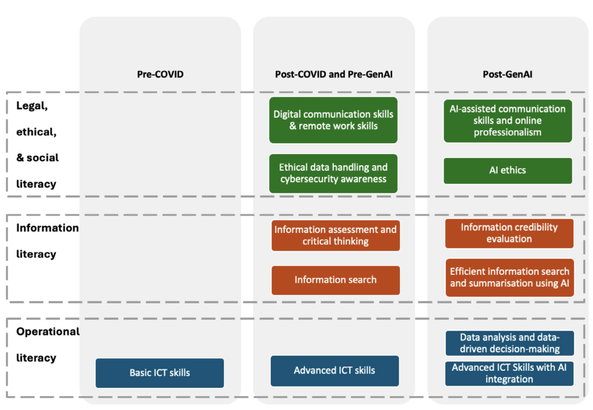

::: qualifier-badge
Teaching Philosophy
:::

My teaching is grounded in the view that digital and computational literacy is essential for modern biology graduates. As biology becomes increasingly data-driven and professional workforces increase their expectations of graduate digital capabilities [@zhou2025], students must be able to interpret data, use computational tools effectively, and communicate findings clearly and ethically. These capabilities are central to developing critical thinking, problem solving, and communication skills. Indeed, the digital competency expected from employers has changed dramatically over last five years, as summarsied by @zhou2025 below, with COVID driving the uptake of hybrid working and collaborative digital workspaces and the recent integration of AI tools in many workplaces.

{width="574"}

## Embedding Computational Skills in Disciplinary Contexts

I approach the teaching of computational skills by embedding them within disciplinary contexts rather than presenting them as abstract techniques. This reflects an interdisciplinary perspective that integrates biology with data science and supports students in applying knowledge across domains. It also recognises that confidence in the appropriate, effective and ethical use of quantitative and computational skills develops through supported, meaningful engagement with technology [@morgan2022].

## Active Participation and Authentic Learning

Active participation is a core principle of my teaching. I design learning experiences that mirror authentic scientific workflows, including data analysis, visualisation, interpretation, and writing. These are structured through **constructive alignment**, ensuring that learning outcomes, activities, and assessment are clearly connected [@biggs2011].

## Assessment and Feedback

Assessment is designed to be authentic and to require application, justification, and clear communication. I incorporate opportunities for feedback and reflection, supporting the development of self-regulated learners. Where appropriate, I integrate generative AI in a structured way, requiring students to evaluate and refine outputs. This supports ethical engagement with emerging technologies and aligns with contemporary approaches to assessment and feedback.

## Inclusive Learning Environments

I aim to create inclusive learning environments in which students feel supported to engage with challenging material and develop confidence in their abilities. This includes clear expectations, scaffolded learning, and opportunities for practice and feedback. This practice is informed by following the principles of Universal Design for Learning [@cast2024UDL] and the concept of reducing cogntive load [@sweller1988]

## Summary

Overall, my teaching focuses on supporting students to become capable and adaptable graduates. By aligning learning with authentic disciplinary practice and providing structured support, I aim to enable deep engagement with biology and computer science while developing transferable skills for future study and professional practice.

------------------------------------------------------------------------

::: {.callout-note appearance="simple"}
**Next:** Explore how these principles are enacted across the [seven CPD qualifiers](cpd1.qmd).
:::
